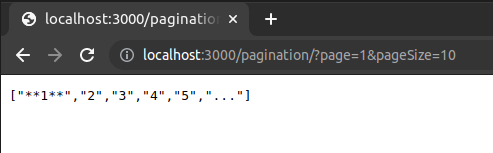
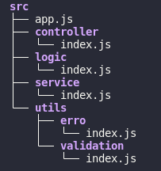

# Boas Vindas ao Projeto Desafio da Raro Labs!

Abaixo irei ensinar como rodar este projeto em sua propria maquina, para que você mesmo possa testa-lo ou modifca-lo como quiser!

# Antes de tudo 

1 - Clone o Repositorio

~~~
    git@github.com:Johnnyrubi/Pagination.git
~~~

2 - Entre na pasta do repositório que você acabou de clonar e Instale as dependências 

~~~
    npm install
~~~

# Após fazer tudo isso o projeto já vai estar na sua maquina. Só precisamos rodar o mesmo!

3 - Entre na pasta onde está o projeto, Abra seu terminal por ele e digite o comando:

~~~
    npm start
~~~

 Em seu terminal a seguinte mensagem deve aparecer:
~~~
    "conectado na porta 3000"
~~~

4 - Abra o navegador e digite a seguinte rota,
    **Lembrete se a rota estiver errada não há como passar os valores para a função**
~~~
    http://localhost:3000/pagination/?page=x$pageSize=y
~~~
**x é o valor de page, y é o valor de pageSize**

5 - Agora é necessario escrever as coisas da seguinte maneira!
                    **muita atenção**
~~~
    /?page=x$pageSize=y
~~~

**Page recebe  o primeiro parametro, sendo o numero que você gostaria de ver em negrito!**
**PageSize vai receber o segundo parametro, sendo o numero maximo da nossa paginação**
se vocẽ quiser passar o numero 1 como primeiro parametro e 10 como segundo parametro você escreveria da seguinte maneira:

~~~
    /?page=1$pageSize=10
~~~

**Retorno esperado:**

 
 

# Estrutura dos respositorios:

# Os testes podem ser rodados com este comando

~~~
    npm run test
~~~

# Você pode passar os valores que quiser mas saiba de algumas regras!

# Regras

**Nenhum valor pode ser 0 ou menor!**

**Page não pode ser maior que pageSize**

**Apenas numeros podem ser passados**
